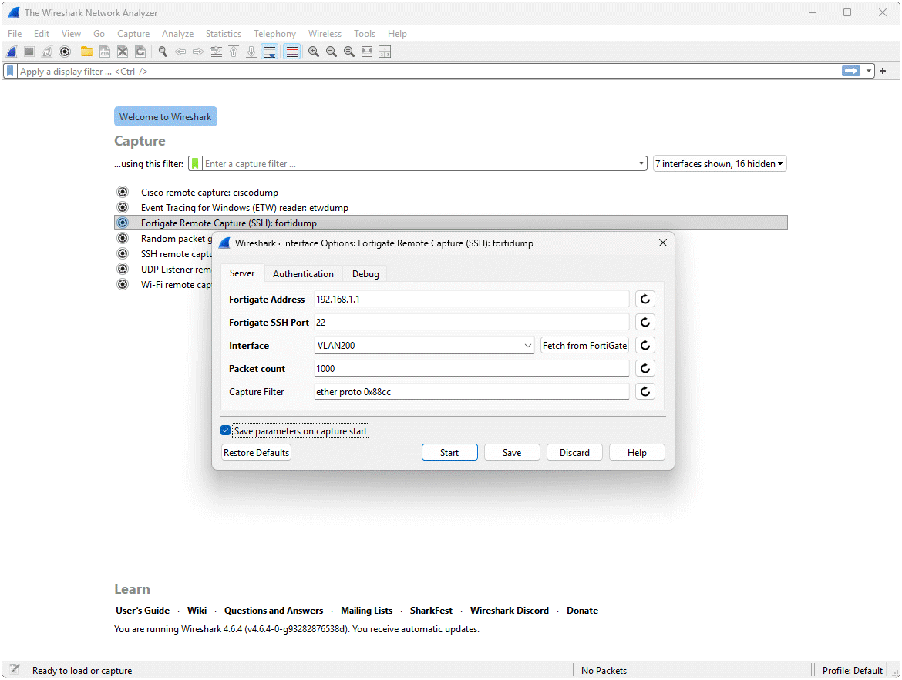

# Wireshark Extcap extension for Fortigate

[](LICENSE)

## Description

This Wireshark Extcap plugin enables real-time packet capture directly from Fortigate devices, streamlining network troubleshooting. It supports defining capture filters within Wireshark and allows multiple parallel capture sessions for enhanced flexibility and analysis.

Extcap plugins extend Wireshark’s capture capabilities by allowing it to collect packets from external sources, such as remote devices or specialized hardware, instead of just local network interfaces. This makes it possible to capture traffic from Fortigate firewalls directly within Wireshark, without needing additional tools or manual exports.



## Features

- Capture & Stream packets directly from the Fortigate into Wireshark
- SSH password or SSH key authentication
- Run parallel capture sessions
- Fortigate VDOM Support
- Simple installation
  
## Installation

1. Download the Latest Version
 - Visit the [Releases](https://github.com/sanderzegers/fortigate-extcap/releases/) page and download the version that matches your platform.

2. Locate the Personal Extcap Folder
 - Open Wireshark.
 - Navigate to Help → About Wireshark → Folders → Personal Extcap Path.
 - Click the Location to open the Extcap folder.

3. Copy the binary to the Extcap folder
 - From the downloaded release, copy the fortigate-extcap.exe (or the appropriate file for your platform) into the "Personal Extcap Path" directory.

4. Restart Wireshark
 - Restart Wireshark to load the custom Extcap extension.

## Quick Start

Once the plugin is installed, it will appear in Wireshark under the capture options as **Fortigate Remote Capture (SSH): fortidump**.
Click the gear icon to configure the following parameters:

**Server Tab**
- **Fortigate Address:** IP or hostname of the target Firewall.
- **Fortigate SSH Port:** The SSH port used to connect.
- **Capture Filter:** Capture filter in tcpdump format. Adjust this to match the traffic you're interested in.
- **Interface:** The Fortigate interface where the capture will run.
- **Packet count:** The maximum number of packets to capture.

**Authentication Tab:**
- **Username:** SSH Username (eg admin). This user must have permissions to capture on the Fortigate
- **Password:** The user's password or optionally the password for the SSH private key

Once everything is configured, start the Extcap by double-clicking it.

## Building from Source

To build the binary on your local machine, make sure Go and Git are installed. 
You can find the plugin folder location in the installation instructions.

Prerequisites: go and git
```bash
apt install git golang-go
```

```bash
git clone https://github.com/sanderzegers/fortigate-extcap.git
cd fortigate-extcap
go build fortidump.go
mkdir -p $HOME/.local/lib/wireshark/extcap
cp fortidump $HOME/.local/lib/wireshark/extcap/fortigate-extcap
```

## Known limitations
- Capture speed is limited to about 10 packets per second, so the tcpdump filter must be set accordingly to limit forwarded packages.
- This Extcap plugin is still under development. Currently it's in an early beta stage.

## License

This project is licensed under the [GNU General Public License v2.0](LICENSE).
