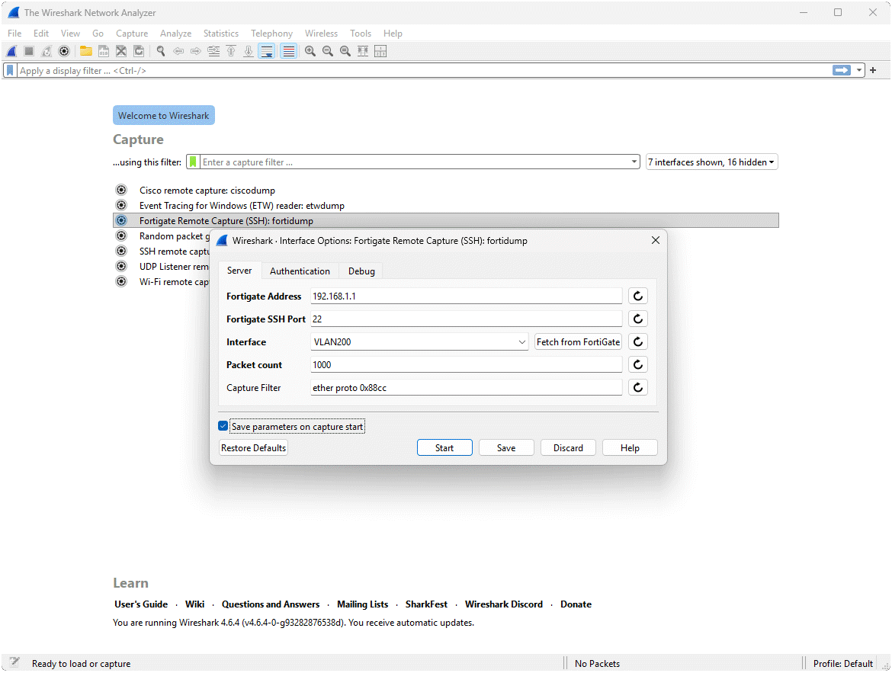

# Wireshark Extcap extension for Fortigate

[](LICENSE)

## Description

With this Wireshark Extcap plugin, you can capture traffic from FortiGate firewalls directly in Wireshark — no extra tools or manual exports needed.



## Features

- Capture & Stream packets directly from the Fortigate into Wireshark
- Per-packet interface name and traffic direction (inbound/outbound) visible in Wireshark
- SSH agent authentication (no credentials on the command line)
- SSH password authentication
- Run multiple live capture sessions simultaneously
- Automatic multi-VDOM detection and support
- Easy installation
  
## Installation

1. Download the Latest Version
 - Visit the [Releases](https://github.com/sanderzegers/fortigate-extcap/releases/) page and download the version that matches your platform.

2. Locate the Personal Extcap Folder
 - Open Wireshark.
 - Navigate to Help → About Wireshark → Folders → Personal Extcap Path.
 - Click the Location to open the Extcap folder.

3. Copy the binary to the Extcap folder
 - From the downloaded release, copy the fortigate-extcap.exe (or the appropriate file for your platform) into the "Personal Extcap Path" directory.

4. Restart Wireshark
 - Restart Wireshark to load the custom Extcap extension.

## Quick Start

Once the plugin is installed, it will appear in Wireshark under the capture options as **Fortigate Remote Capture (SSH): fortidump**.
Click the gear icon to configure the following parameters:

**Server Tab**
- **Fortigate Address:** IP or hostname of the target Firewall.
- **Fortigate SSH Port:** The SSH port used to connect.
- **Capture Filter:** Capture filter in tcpdump format. Adjust this to match the traffic you're interested in.
- **Interface:** The Fortigate interface where the capture will run.
- **Packet count:** The maximum number of packets to capture.

**Authentication Tab:**
- **Username:** SSH Username (e.g. `admin`). This user must have CLI access permissions on the FortiGate.
- **Password:** The user's SSH password. Leave empty when using SSH agent authentication.

The plugin supports two authentication methods, tried in this order:
1. **SSH agent** — if an SSH agent is running with a key loaded for the FortiGate, no password is needed. This is the recommended approach as it keeps credentials off the command line.
2. **Password** — enter the password in the field above.

**Debug Tab:**
- **Known Hostsfile:** Path to the SSH known_hosts file. Defaults to `~/.ssh/known_hosts`. The FortiGate's host key is automatically added on first connection.

Once everything is configured, start the capture by double-clicking the interface.

## Building from Source

To build the binary on your local machine, make sure Go and Git are installed. 
You can find the plugin folder location in the installation instructions.

Prerequisites: go and git
```bash
apt install git golang-go
```

```bash
git clone https://github.com/sanderzegers/fortigate-extcap.git
cd fortigate-extcap
make build
mkdir -p $HOME/.local/lib/wireshark/extcap
cp fortigate-extcap $HOME/.local/lib/wireshark/extcap/fortigate-extcap
```

## Documentation

For full configuration details, authentication setup, and troubleshooting, see the [Help Documentation](docs/index.md).

## Known limitations
- Capture speed is limited by the FortiGate's `diagnose sniffer packet` command, which streams packets as a text hexdump over SSH rather than a binary protocol. Use a specific capture filter to focus on the traffic you need and avoid overloading the stream.
- This Extcap plugin is still under development. Currently it's in an early beta stage.

## License

This project is licensed under the [GNU General Public License v2.0](LICENSE).
