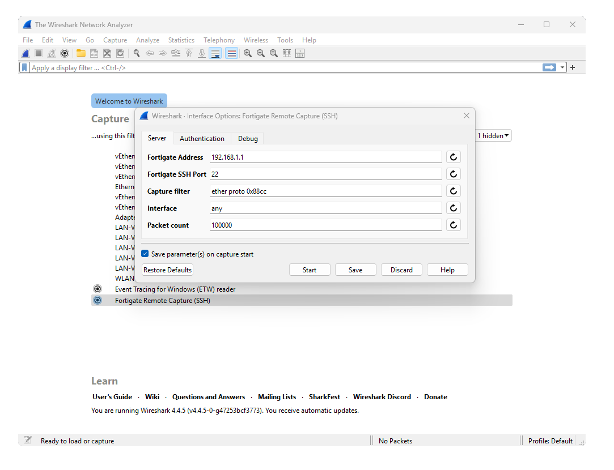

# Wireshark Extcap extension for Fortigate

## Description

This Wireshark Extcap extension enables live network packet capture directly from Fortigate devices into Wireshark.

asdfsadfadsf

## Features

- Capture packets live into Wireshark
- Fortigate VDOM Support
- Simple installation

## Installation

1. Download the Latest Version
 - Visit the [Releases](https://github.com/sanderzegers/fortigate-extcap/releases/) page and download the version that matches your platform.

2. Locate the Personal Extcap Path
 - Open Wireshark.
 - Navigate to Help → About Wireshark → Folders → Personal Extcap Path.
 - Click the Location to open the Extcap folder.

3. Copy the binary to excapt folder
 - From the downloaded release, copy the fortigate-extcap.exe (or the appropriate file for your platform) into the "Personal Extcap Path" directory.

4. Restart Wireshark
 - Restart Wireshark to load the custom extcap extension.

## Known limitations

This extcap is still under development. Currently it's in an early alpha stage.

## License

This project is licensed under the [GNU General Public License v2.0](LICENSE).
