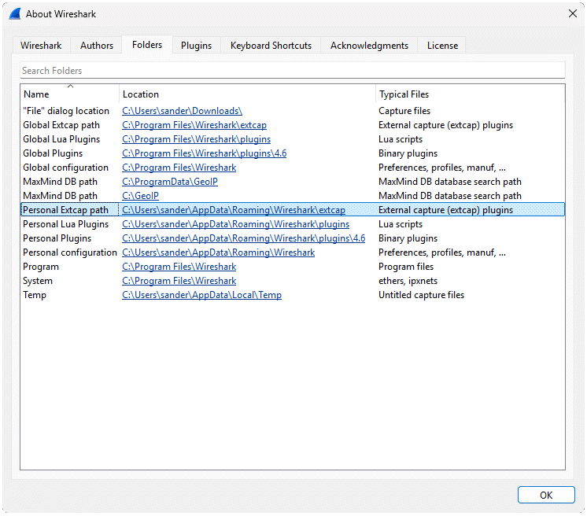
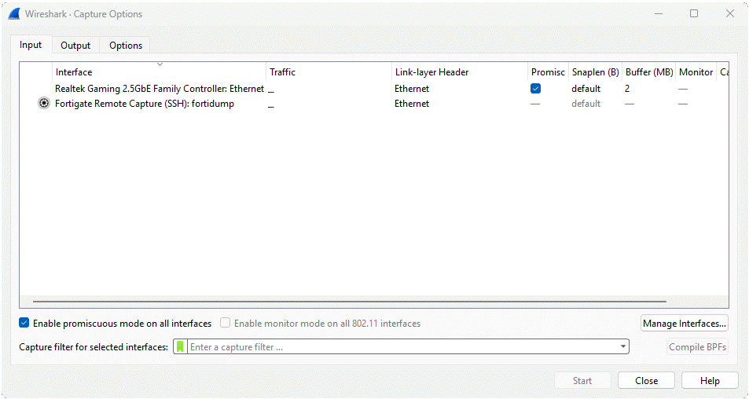
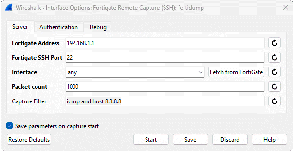
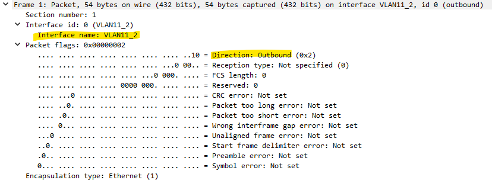
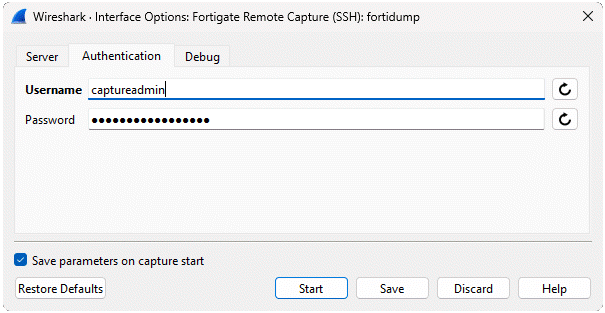
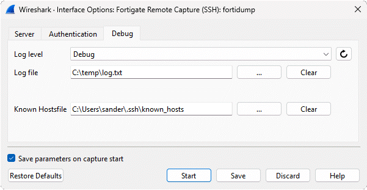

# FortiGate Extcap Plugin

This plugin lets you capture packets directly from a FortiGate firewall into Wireshark over SSH.

## Installation

1. Download the Latest Version

- Visit the [Releases](https://github.com/sanderzegers/fortigate-extcap/releases/) page and download the version that matches your platform.

2. Locate the Personal Extcap Folder

- Open Wireshark

- Navigate to Help → About Wireshark → Folders → Personal Extcap Path.

- Click the Location to open the Extcap folder

  You can install extcap plugins in either the global or personal extcap path. The global path requires admin permissions but makes the plugin available to all users on the system.

  

3. Copy the binary to the extcap folder.

- Copy `fortigate-extcap.exe` (or the appropriate file for your platform) from the downloaded release into the “Personal Extcap Path” directory.

- On Linux or macOS, make the plugin executable: `chmod a+x fortidump`

  

4. Restart Wireshark

- Restart Wireshark to load the custom Extcap extension.

## Starting first capture

After succseful installation, the extcap plugin should become visible as Fortigate Remote Capture. Click on the gear icon to configure the settings.



## Configuration

### Server Tab



| Field | Description |
|---|---|
| **FortiGate Address** | IP address or hostname of the FortiGate. |
| **FortiGate SSH Port** | SSH port (default: 22) |
| **Interface** | FortiGate interface to capture on (e.g., `port1`, `any`). When set to `any`, each packet in Wireshark shows which interface it arrived on. Click on "Fetch from FortiGate" to retrieve interfaces from the FortiGate. If the interfaces are not updated, verify the FortiGate address, port, and credentials. For more detailed information, check the debug log. |
| **Packet count** | Maximum number of packets to capture. Set to `0` for unlimited. |
| **Capture Filter** | Capture filter in tcpdump syntax (e.g. `not port 443`). Leave empty to capture all traffic. The SSH management session is excluded automatically. |


**Capture Interface:** Wireshark displays the FortiGate interface name for each packet (shown in the frame details under *Interface name*). It also records whether the traffic is inbound or outbound relative to the FortiGate. 




**Multi-VDOM:** The plugin automatically detects whether the FortiGate is running in multi-VDOM mode and enters the correct VDOM context before starting the capture. No manual configuration is needed.


### Authentication Tab



| Field | Description |
|---|---|
| **Username** | SSH username (e.g. `admin`). Must have CLI access on the FortiGate. |
| **Password** | SSH password. Leave empty when using SSH agent authentication. When using password authentication, the password is visible in the process list for the entire duration of the capture. Use SSH agent authentication to avoid this. |

The plugin supports two authentication methods, tried in this order:

1. **SSH agent**: if an SSH agent is running with a key loaded for the FortiGate, no password is needed. This is the recommended approach as no credentials appear on the command line.
2. **Password**: plain SSH password entered in the field above.


**Setting up SSH agent (Linux/macOS):**

```bash
# Optional: generate a new key pair if you don't have one yet
ssh-keygen -t ed25519 -f ~/.ssh/id_ed25519
# Add your key to the agent — type your passphrase once
ssh-add ~/.ssh/id_ed25519
```


**Setting up SSH agent (Windows):**
```powershell
# Run once as administrator
Set-Service ssh-agent -StartupType Automatic
Start-Service ssh-agent
# Optional: generate a new key pair if you don't have one yet
ssh-keygen -t ed25519 -f C:\Users\you\.ssh\id_ed25519
# Add your key to the agent
ssh-add C:\Users\you\.ssh\id_ed25519
```


For SSH agent to work, the FortiGate user must have the corresponding public key configured. Copy the contents of your `.pub` file (e.g. `~/.ssh/id_ed25519.pub`) into the FortiGate config:
```
config system admin
    edit admin
        set ssh-public-key1 "ssh-ed25519 AAAA..."
    next
end
```

**Note:** FortiGate requires a password to be set on every admin account, even when using SSH key authentication. Since this password will never be used for day-to-day access, set it to a long randomly generated string (32+ characters) and store it in a password manager.


### Debug Tab



| Field | Description |
|---|---|
| **Log level** | Verbosity of the log output. `Error` is the default. Set to `Debug` when troubleshooting. |
| **Log file** | Path to write log output to. No output is written unless a file is specified. |
| **Known Hostsfile** | Path to the SSH known_hosts file (default: `~/.ssh/known_hosts`). The FortiGate host key is added automatically on first connection. |


## Known Limitations

- Capture speed is limited by the FortiGate's `diagnose sniffer packet` command, which streams packets as a text hexdump over SSH rather than a binary protocol. Use a specific capture filter to focus on the traffic you need and avoid overloading the stream.


## Troubleshooting

**Wireshark shows no FortiGate extcap plugin after installing**
- Make sure the binary is placed in the correct extcap folder: *Help → About Wireshark → Folders → Personal Extcap Path*
- On Linux/macOS, make sure the binary is executable: `chmod +x fortigate-extcap`

**Authentication failed**
- Verify the username has CLI access on the FortiGate (not just web UI access).
- If using SSH agent, confirm the agent is running (`ssh-add -l`) and the FortiGate user has the public key configured.
- If using password, verify the password is correct.

**Host key mismatch error**
- The FortiGate's SSH host key has changed. Remove the old entry with: `ssh-keygen -R <fortigate-address>`

**Capture starts but no packets appear**
- Your capture filter may be too restrictive, or the interface name is wrong. Try `any` as the interface and leave the capture filter empty.

**Packets missing from capture**
- FortiGate's NP offloading accelerates traffic through dedicated hardware processors, bypassing the software sniffer. To capture this traffic, temporarily disable NP offloading on the relevant firewall policy and re-enable it when done:
```
config firewall policy
    edit <id>
        set auto-asic-offload disable
    next
end
```

## More Information

- [GitHub Repository](https://github.com/sanderzegers/fortigate-extcap)
- [Report an Issue](https://github.com/sanderzegers/fortigate-extcap/issues)
